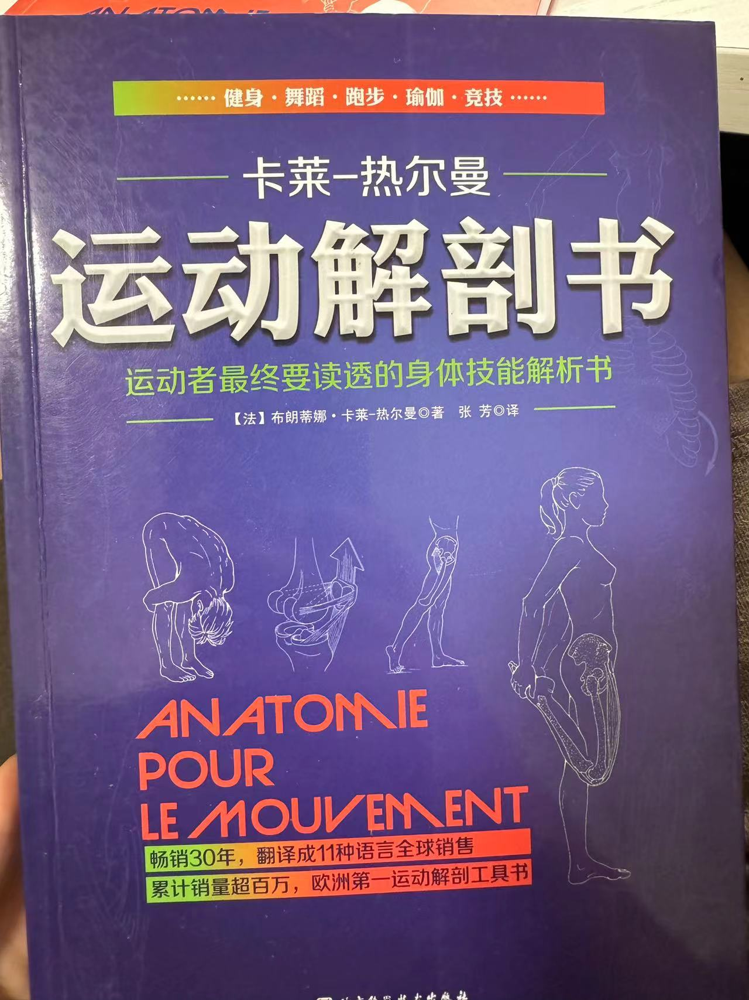

### 目录

- [1. 前言](#1-前言)
- [2. 现状](#2-现状)
  - [2.1 2023的确诊](#21-2023的确诊)
  - [2.2 2024的变化](#22-2024的变化)
- [3. 未来](#3-做与不做，这是个问题)

# 1. 前言

开始前先废话几句，最近留意到自己在一些重要的时机下，表达能力很有限，缺乏逻辑、阿巴阿巴。加之前段时间看到一个小调查，说”大部分“人在脱离高考语文写作之后，500字以上的写作容易出现表述不清的情况（我上次写500字是什么时候…？），为了改善这一情况，后面会尝试写一些长文，又是一个新坑呀！

朋友们应该能注意到，我的走路姿势是有问题的，一是踮脚，二是屁股会扭，这也分别暴露我踝与髋两处的问题。

我从小学就开始打篮球了，而篮球是非常典型的非对称发力，比如你是右撇子，那你的左脚就会是起跳脚，承担更多的发力，肌肉力量更强。由于发力模式的问题，右腿的肌肉力量相对较弱就容易受伤，并且我右脚足底是有轻微的筋膜炎，左右力线不对成，这给后来的受伤埋下了隐患。

一切要从初二的军训说起，真是糟糕至极的体验。14人一间宿舍没有空调夏天，闷热的天气加上一群十三四岁的小孩突然离开家在外面过夜，闹腾是少不了的。而我刚好是宿舍长，这又是军训，惩罚是相当严苛的。晚上睡觉的时候，宿舍里总有人不安分讲话，讲话一被抓住，就要罚做深蹲，作为宿舍长就要连坐，而且我要做他的倍数。晚上讲话只是场景之一，除此之外还有很多其他情况：排队不遵守纪律、迟到……最后的结果就是，我做了非常非常多的深蹲，以及其他各种形式的体罚，多到我走路都没法走，走着走着就会突然腿一软就跪下去了，现在回想起来是非常典型的训练过度导致肌肉撕裂。前文提到，我的左右力线本就不对成，在这如此大量的运动刺激下，问题首次爆发了。军训结束后，我妈就说我怎么这样走路，这就是开始。

而后就是一些慢性疼痛，一直到体育中考我就只是右侧的足底和膝盖不舒服，没什么大问题，那会关于运动康复的意识还没有现在这么强，天天运动量这么大，谁身上还没点疼的，也就置之不理了。到中考之后，摆脱了中考的压力，运动量更是大减，问题继续隐藏了。

直到高考前夕，打球崴脚，由于高三疫情长期缺乏锻炼，关节稳定性很差，那次崴脚很严重，韧带撕裂的程度到了80%左右。但后天就要高考，时间紧迫，加之没有处理经验，去平乐骨伤科确认了一下不是骨折，就开了点药膏自己敷了，这也导致我右脚踝后面恢复的很差，进一步加重了左右力线的不对称。这就是走路踝部分的原因，正常的走路姿势是脚后跟先着地，制动承接体重，踝膝髋再一起发力重心前移带动人向前。但由于韧带的损伤，我的踝关节的稳定性很差，背屈能力即勾脚尖的能力不足，致使有时没能勾到位，让脚尖先着地，造成了踮脚的效果。

在此也提醒大家，如果有任何运动损伤，请勿去骨科看，去找专业的运动医学科和专门的康复机构治疗！

高考后，踝也没再进一步治疗，不疼了之后，我就开始健身了。我始终再强调左右力线的对称，以及关节的稳定性，没有健康的体态就盲目的锻炼、上重量，无异于在松垮的地基上建大厦。很不幸，经过一通瞎练，我右髋的不适越来越明显，走路也在代偿出现问题。我注意到了这一点，买了书自己学习，但感觉只是骨盆左旋加前倾，始终没往结构性的损伤上想。

    
    

# 2. 现状

## 2.1 2023的确诊

一直以为只是体态问题，倒也没太放在心上。正巧23年暑假有时间，保研结束的很顺利，在老妈的督促下就去医院做了检查，拍了单髋核磁，这点必须表扬一下，深圳的大夫水平一言难尽但做检查是真的快啊！检查结果如下：

盂唇撕裂，这髋关节边缘的一块软骨，可以理解为跟半月板类似的东西。拿着结果去找大夫复查，他用了几十秒看完了我的结果，跟我说你这是髋撞。我第一次得知了这个名次，也终于知道了自己的了什么“病”。

“髋臼股骨撞击症（femoral acetabular impingement，FAI）是一种由于股骨头和（或）髋臼的解剖结构异常，髋关节在活动时股骨近端和髋臼边缘之间形成撞击，造成髋臼软骨和髋臼盂唇损伤、髋关节慢性疼痛和髋关节活动范围受限的一种疾病。”

我和大夫的后续对话如下：

“那该怎么治呢？”

“做手术。”

”手术是怎么做呢？“

”把你撕裂的部分缝合回去，再把突起的骨头给磨平。“

”除了手术还有别的办法吗？“

”没有。“

”…….“

”如果不影响你的生活，你不做也行，我给你开点消炎药先。“

没来得及和医生再多说几句，他已经叫了下一位患者，困扰了我许多年的问题解决了，我终于知道自己身体出了什么问题，嗯，也只是知道了。

对于开刀，我是有天然的恐惧的，手术的风险，无法保证的康复效果，未来的漫长人生……但除了开刀，我还有别的选择吗？我不知道，我也无法下定决心，刚好马上也要回北京返校，就在老妈的去北京再找大夫看看的说法中，把这个选择继续推迟了。

## 2.2 2024年的变化

回北京后，迎面而来的是企业实习以及前往德国交换，我很忙。加上髋撞实在是一个比较小众的病，有名的大医生都排队排到明年去了，早上起来抢号是绝对抢不到，加号也得加到两周后了，我本身也很讨厌去医院的感觉，就一直拖着没去看。九月转眼就过，我也即将去往德国，做不做手术这一选择又被推迟了。

在德国期间基本是在静养，半年的时间没怎么运动，疼痛炎症确实减轻了但我的感觉却并不好。缺少了肌肉的力量，关节更不稳定体感依然不好，疼痛没有消失只是换了种形式。回国之后，一直在很克制的自主进行些康复训练，运动量较少加合理的康复训练，我的情况有了改善，这也给了我一定的信心。

关注了我微博的朋友知道，前两个月我下定决心开始减肥了，坚持骑车、跑步、游泳，体重确实下降了，可喜可贺到目前位置我已经瘦了十斤多。但运动量增大，炎症疼痛也开始出现，髋周肌肉的酸胀也让人不适。恰巧这个假期又是很有空，回深圳后，前几天又重新去找了广东片区最有名的大夫看，检查结果如下：

    
    
    

    
    
    

对比去年没有明显的恶化，依然是炎症，明显的盂唇撕裂。找专家大夫看结果，对话如下：

”你这么年轻，这样子了已经…啧“

”我这是有哪几种撞击？“

”嗯…现在临床上都是混合型的…“

”不过你这个凸棱还是很明显的，“

”我还是建议你做手术吧，这个骨表面已经有增生了，现在不做以后会很麻烦。“

”但我感觉我的症状不是很重，只是运动量大的时候不适比较明显，我肌肉力量也比较好。“

”我先给你查个体吧。“

”你看你这个还是限位，外旋了，我还是建议你手术，如果考虑好了就打这个电话就行。“

”那我不需要先保守观察一下吗？而且我有积液，先给我开点消炎药呢？“

”没必要了。“

”大夫你好，我是…“（下一位患者已经进来了

出医院之后，心情有些沉重，专家的话份量自是更重，我倾向于做，长期的疼痛让我不堪其扰，可一旦开刀就再没回头路。和老妈简单说了下情况，用一种尽量轻松的语气，省得他担心。我考虑了一路，回家后也没胃口吃饭，就这样躺到了傍晚。

# 3. 做与不做，这是个问题

这实在是个太难太难的决定，我现在没有到必须要做手术的程度，但不做手术可能会进一步恶化，可就算做了手术也无法保证预后，手术本身也存在风险。

我还年轻，我才21，我想以后能自由自在的游泳、奔跑、跳跃、骑车…手术可能可以根治我的问题。

我还年轻，我才21，我想以后能自由自在的游泳、奔跑、跳跃、骑车…手术及预后不好的话带来的新损伤也将是一辈子的。

小姨听老妈说了我的情况后，很关切的跟我说了很多，小姨自幼身体不好，大大小小的手术做了很多，她建议我不要做。她说：“如果只是以后不能打球、跑步或者骑车，那你就去游泳、去打羽毛球，去做些别的运动。有些东西是可以选择的，可以舍弃的，但一旦你选择了做手术，你就没有选择了。天生的就是最好的，不要轻易去动他，不能运动就不能运动，人生都是会有些遗憾的。”

是啊！人生总会有些遗憾。

是吗？真的无能为力吗？

我不知道，如果我是那种很有活力的人，说不定想着长痛不如短痛，直接就去做了，做了再说。如果我是那种很保守很安稳的人，肯定坚定选择不做选择保守治疗了，倒也省的烦恼。

所以我到底是什么样的人？就是啥都沾一点的拧巴人吧哈哈哈，有时候有路见不平一声吼的豪气，有时又事不关己高高挂起的路人心；有时想兼济天下做一番大事业，有时只想当小市民过好自己的日子；有时当大方坦荡侠义肝胆不求回报的大侠，有时又斤斤计较阴暗爬行。我不知道自己到底是什么样的人，不了解自己到底想要什么，又如何去做选择呢？“都可以”，这真的是一个糟糕的答案。

人的脆弱和坚强都远超自己的想象，刚进深中的时候，有个学长说生活是选择的艺术，说的真好哇！人生就是无数的选择交织而成的，但经历了这么多选择，我似乎还是没总结出经验，不知道什么是适合自己的，总是在挣扎、后悔，这令我费解。

做与不做，这对我来说，真的是个问题。
